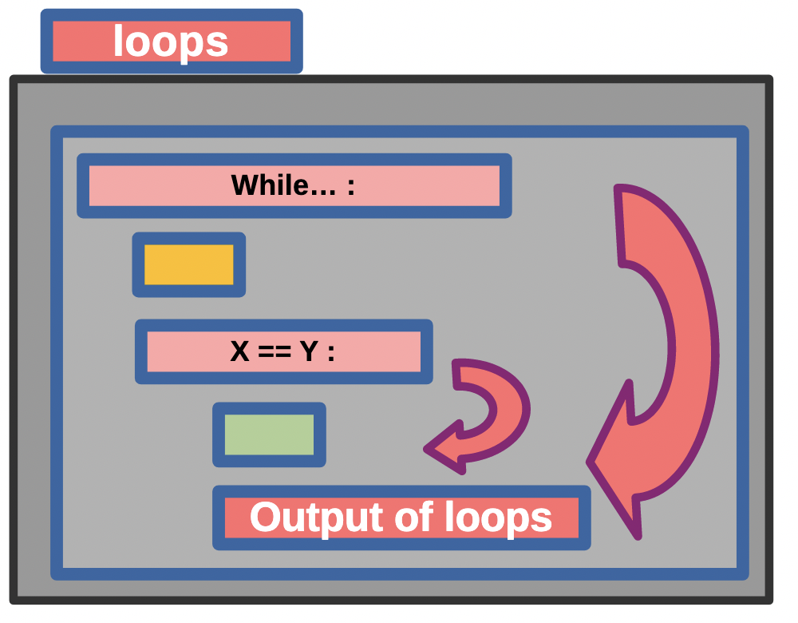

# Lab 01: Mastering Python Loops 🔄

## Assigned and Due

* __Assigned__: Friday, 23th January 2026 at 2:30pm
* __Due__: Friday 30th January 2026 at 2:35pm
* __Expiration__: Thursday, 6th February 2026 at 2:35pm

Note: the _expiration_ date is the last date you can submit your work for a grade.



## 🎯 Learning Objectives

Welcome to Lab 01! This week, you'll become a loop master by completing six fun Python programs. Each program will help you understand different types of loops and how to use them effectively.

## 🎯 Learning Objectives

By the end of this lab, you will be able to:
- Use `for` loops with the `range()` function to iterate over numbers
- Loop through strings character by character
- Apply `while` loops for condition-based iteration
- Create nested loops for patterns and tables
- Process lists and dictionaries using loops
- Combine loops with conditional statements

## 📚 Lab Overview

You have **one week** to complete this lab. Don't worry - each program is designed to build your skills step by step!

## 🚀 Getting Started

1. **Create a local working space**: A local directory is used to keep all your labs together in the same spot on your local machine and will help you locate them for future use. Please note that these local repositories are **located on your machine* and will still need to be pushed to GitHub. The UNIX command to create a local directory `cs101Spring2026/labs` is as follows (if you are using a Windows machine, you can create the directory using File Explorer or use Git Bash to run the command below):

    ```bash
    mkdir -p cs101Spring2026/labs
    ```

Keep all your labs together in this local directory. If you are working with an activity, create a similar local directory for your course activities.

2. **Clone this repository** to your computer. Use the command: `git clone <your-repo-url>` to clone the repository.
3. **Open the `src/` folder** in your code editor
4. **Start with `program1.py`** and work your way through each program
5. **Look for TODO comments** - these tell you exactly where to add your code. Please be sure to REMOVE the `TODO` comments after you have completed each task.
6. **Run each program** to test your work: `python3 src/program1.py`
7. **Fill out `writing/reflection.md`** when you are done coding


## 📝 Program Descriptions

### Program 1: Number Pattern Printer 🔢

**File:** `src/program1.py`

**What You'll Learn:** Basic `for` loops with `range()`

**What It Does:**

- Prints numbers from 1 to 10
- Prints even numbers from 2 to 20
- Counts down from 10 to 1
- Calculates the sum of numbers 1 to 100

**Expected Output:**

```text
==================================================
Program 1: Number Pattern Printer
==================================================

Numbers from 1 to 10:
1
2
3
...
10

Even numbers from 2 to 20:
2
4
6
...
20

Countdown from 10 to 1:
10
9
8
...
1

Sum of numbers from 1 to 100:
The sum is: 5050

==================================================
Program 1 Complete!
==================================================
```

**Key Concepts:** `range()` function, loop variables, accumulator pattern

---

### Program 2: String Character Explorer 🔤

**File:** `src/program2.py`

**What You'll Learn:** Looping through strings

**What It Does:**
- Prints each character of a string on a separate line
- Counts vowels in a message
- Shows each character with its index position
- Extracts only uppercase letters from a string

**Expected Output:**

```text
==================================================
Program 2: String Character Explorer
==================================================

Original message: Python Programming is Fun!

Each character on a separate line:
P
y
t
h
...

Counting vowels:
Number of vowels: 7

Characters with their positions:
Index 0: P
Index 1: y
Index 2: t
...

Extracting uppercase letters:
Uppercase letters only: PPF

==================================================
Program 2 Complete!
==================================================
```

**Key Concepts:** String iteration, `enumerate()`, character methods (`.isupper()`), string concatenation

---

### Program 3: While Loop Adventure ⏰

**File:** `src/program3.py`

**What You'll Learn:** Using `while` loops with conditions

**What It Does:**

- Counts from 1 to 5 using a while loop
- Doubles a number until it exceeds 1000
- Simulates a password checker with limited attempts
- Adds consecutive numbers until the sum reaches 50

**Expected Output:**

```text
==================================================
Program 3: While Loop Adventure
==================================================

Counting with while loop (1 to 5):
1
2
3
4
5

Doubling numbers until exceeding 1000:
1
2
4
8
16
...
512
1024

Password checking simulation:
Attempt 1: Trying password 'wrong1'
Incorrect password.
...
Access granted!

Adding numbers until sum reaches 50:
Adding 1, total is now 1
Adding 2, total is now 3
Adding 3, total is now 6
...

==================================================
Program 3 Complete!
==================================================
```

**Key Concepts:** `while` loops, loop control (incrementing), `break` statement, condition-based iteration

---

### Program 4: Nested Loops and Patterns 🎨

**File:** `src/program4.py`

**What You'll Learn:** Using nested loops to create patterns

**What It Does:**

- Creates a rectangle of stars (5 rows by 8 columns)
- Draws a right triangle with increasing stars
- Generates a multiplication table (1-5)
- Builds a number pyramid

**Expected Output:**

```text
==================================================
Program 4: Nested Loops and Patterns
==================================================

Pattern 1: Rectangle (5x8)
********
********
********
********
********

Pattern 2: Right Triangle
*
**
***
****
*****

Pattern 3: Multiplication Table (1-5)
       1   2   3   4   5
   --------------------
1 |    1   2   3   4   5
2 |    2   4   6   8  10
3 |    3   6   9  12  15
4 |    4   8  12  16  20
5 |    5  10  15  20  25

Pattern 4: Number Pyramid
   1
  121
 12321
1234321

==================================================
Program 4 Complete!
==================================================
```

**Key Concepts:** Nested loops, outer/inner loop relationship, pattern building, print formatting

---

### Program 5: List Processing with Loops 📊

**File:** `src/program5.py`

**What You'll Learn:** Processing lists with loops and conditionals

**What It Does:**

- Prints list items with their indices
- Filters even numbers from a list
- Calculates statistics (sum, average, max, min)
- Filters names by length
- Analyzes temperature data
- Creates a new list with modified values

**Expected Output:**

```text
==================================================
Program 5: List Processing with Loops
==================================================

List of numbers with indices:
Original list: [15, 42, 7, 23, 8, 16, 31, 4, 19, 12]
Index 0: 15
Index 1: 42
...

Even numbers from the list:
42
8
16
4
12

Number statistics:
Sum: 177
Average: 17.7
Largest: 42
Smallest: 4

Names with 5 or more characters:
Alice
Charlie
Diana
Frank

Temperature analysis:
Days above 75°: 4
Days below 70°: 3
Comfortable days (70-75°): 3

Doubled numbers:
Original: [15, 42, 7, 23, 8, 16, 31, 4, 19, 12]
Doubled: [30, 84, 14, 46, 16, 32, 62, 8, 38, 24]

==================================================
Program 5 Complete!
==================================================
```

**Key Concepts:** List iteration, `enumerate()`, filtering with conditionals, accumulator pattern, list methods (`.append()`)

---

### Program 6: Dictionary Explorer with Loops 📚

**File:** `src/program6.py`

**What You'll Learn:** Looping through dictionaries

**What It Does:**

- Prints all key-value pairs from a dictionary
- Calculates class grade statistics
- Categorizes grades (A, B, C, D, F)
- Finds students above average
- Generates inventory reports
- Identifies low-stock items
- Calculates total inventory

**Expected Output:**

```text
==================================================
Program 6: Dictionary Explorer with Loops
==================================================

Student Grade Report:
------------------------------
Alice: 92
Bob: 87
Charlie: 78
...

Class Statistics:
Total students: 8
Average grade: 86.25
Highest grade: 95
Lowest grade: 76

Grade Categories:
A (90-100): 3 students
B (80-89): 3 students
C (70-79): 2 students
D (60-69): 0 students
F (below 60): 0 students

Students scoring above average:
Alice: 92
Diana: 95
Frank: 88
Grace: 91

Store Inventory Report:
------------------------------
apples: 45 in stock
bananas: 32 in stock
...

Low Stock Alert (less than 20 items):
grapes: only 15 left!
strawberries: only 8 left!

Total Inventory:
Total items in stock: 128

==================================================
Program 6 Complete!
==================================================
```

**Key Concepts:** Dictionary iteration, `.items()`, `.keys()`, `.values()` methods, processing key-value pairs

---


## ✅ How to Complete This Lab

1. **Work through each program in order** - they build on each other!
2. **Read the comments carefully** - they contain helpful hints
3. **Test your code frequently** - run the program after each step
4. **Don't be afraid to experiment** - try things and see what happens!
5. **Ask for help if you are stuck** - that's what learning is all about!

## 🧪 Testing Your Code

To run any program, use the terminal:

```bash
# Run from the lab directory
python3 src/program1.py
python3 src/program2.py
python3 src/program3.py
python3 src/program4.py
python3 src/program5.py
python3 src/program6.py
```

Your output should match the expected output shown above for each program.

## 📖 Reflection Questions

Once you've completed all six programs, answer the questions in `writing/reflection.md`. These questions will help you think deeply about what you learned.

## 💡 Tips for Success

- **Start early!** - Don't wait until the last day
- **Work on one program at a time** - Complete your work fully before moving on
- **Read the error messages** - Messages tell you what to fix is there is an execution problem
- **Use print statements** - Adding lines to tell you what is happening in your code is often helpful.
- **Compare your output** - Does your output look like what is expected?
- **Review the lesson materials** - Need ideas to finish your work, check your course slides and notes for a refresher on concepts.
- **Take breaks** - If you get stuck, step away for a bit and return with fresh eyes (and renewed energy!).


## 📤 Submission

When you are ready to submit:
1. Make sure all six programs run without errors
2. Complete the `writing/reflection.md` file
3. Test each program one more time
4. Commit and push your changes to GitHub
5. Submit the link to your repository

### Committing and Pushing Your Work

As you are working on your lab, you are to commit and push regularly. The commands (in the bash terminal) are shown below. Note: You can also use your VSCode editor (or similar) to commit and push your work. After you have pushed your work to your repository, please visit the repository at the GitHub website (you may have to log-in using your browser) to verify that your files were correctly sent.

 ``` bash
git add -A
git commit -m ``Your notes about commit here''
git push
```

---

## Project Assessment

The grade that a student receives on this assignment will have the following components.

* **GitHub Actions CI Build Status [up to 15%]:**: For the lab repository associated with this assignment students will receive a checkmark grade if their last before-the-deadline build passes. This is only checking some baseline writing and commit requirements as well as correct running of the program. An additional reduction will given if the commit log shows a cluster of commits at the end clearly used just to pass this requirement. An addition reduction will also be given if there is no commit during lab work times. All other requirements are evaluated manually.

* **Mastery of Technical Writing [up to 50%]:**: Students will also receive a checkmark grade when the responses to the writing questions presented in the `reflection.md` reveal a proficiency of both writing skills and technical knowledge. To receive a checkmark grade, the submitted writing should have correct spelling, grammar, and punctuation in addition to following the rules of Markdown and providing conceptually and technically accurate answers.

* **Mastery of Technical Knowledge and Skills [up to 35%]**: Students will receive a portion of their assignment grade when their program implementation reveals that they have mastered all of the technical knowledge and skills developed during the completion of this assignment. As a part of this grade, the instructor will assess aspects of the programming including, but not limited to, the completeness and the correctness of the program and the use of effective source code comments.

## Code Review Component

As a separate grade, students will be required to complete code reviews of labs with the instructor or a Technical Leader. During this session, the student will be asked to demonstrate their understanding of the code they have written, and to provide responses to questions concerning specific programming concepts used in their implementation. The topics for this week's lab are listed below.

* Demonstrate working code (no errors during execution).
* Demonstrate documentation in code.
* Demonstrate that the code is complete, according to the assignment specifications.
* Discussion of `range()`, `len()` functions, in addition to loops involving these functions.

## GatorGrade

### Checks for GatorGrade

For immediate feedback on submissions, we will be using Gator Grade to inform the of missing components in the submission. As you submit, you will notice that there is a thick red X that will change to a green check mark when all components have been included in the submission. You are encouraged to click on the red X to find a listing of the components to address.

You can check the baseline writing and commit requirements for this lab assignment by running department's assignment checking `gatorgrade` tool. To use `gatorgrade`, you first need to make sure you have Python3 installed (type `python --version` to check). If you do not have Python installed, please see:

- [Setting Up Python on Windows](https://realpython.com/lessons/python-windows-setup/)
- [Python 3 Installation and Setup Guide](https://realpython.com/installing-python/)
- [How to Install Python 3 and Set Up a Local Programming Environment on Windows 10](https://www.digitalocean.com/community/tutorials/how-to-install-python-3-and-set-up-a-local-programming-environment-on-windows-10)

Then, if you have not done so already, you need to install `gatorgrade`:

- First, [install `pipx`](https://pypa.github.io/pipx/installation/)
- Then, install `gatorgrade` with `pipx install gatorgrade`

Finally, you can run `gatorgrade`: `gatorgrade --config config/gatorgrade.yml`

## Seeking Assistance
## 🆘 Getting Help

If you are stuck:

1. Read the hints in the code comments
2. Review the class materials
3. Try breaking the problem into smaller steps
4. Ask a classmate, Technical Leaders or your instructor

* Extra resources for using markdown include;
  + [Markdown Tidbits](https://www.youtube.com/watch?v=cdJEUAy5IyA)
  + [Markdown Cheatsheet](https://github.com/adam-p/markdown-here/wiki/Markdown-Cheatsheet)

Students who have questions about this project outside of the lab time are invited to ask them in the course's Discord channel or during instructor's or TL's office hours.
